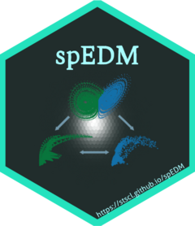

# spEDM

<!-- badges: start -->

[](https://CRAN.R-project.org/package=spEDM)
[](https://CRAN.R-project.org/package=spEDM)
[](https://cran.r-project.org/web/checks/check_results_spEDM.html)
[](https://CRAN.R-project.org/package=spEDM)
[](https://CRAN.R-project.org/package=spEDM)
[](http://www.gnu.org/licenses/gpl-3.0.html)
[](https://lifecycle.r-lib.org/articles/stages.html#stable)
[](https://github.com/stscl/spEDM/actions/workflows/R-CMD-check.yaml)
[](https://stscl.r-universe.dev/spEDM)
[](https://doi.org/10.1080/13658816.2026.2687121)

<!-- badges: end -->

<a href="https://stscl.github.io/spEDM/"></a>

***Sp**atial **E**mpirical **D**ynamic **M**odeling*

*spEDM* is an R package for spatial causal discovery. It extends Empirical Dynamic Modeling (EDM) from time series to spatial cross-sectional data, provides seamless support for vector and raster spatial data via tight integration with the [*sf*](https://CRAN.R-project.org/package=sf) and [*terra*](https://CRAN.R-project.org/package=terra) packages, and enables data-driven causal inference from spatial snapshots.

> *Refer to the package documentation <https://stscl.github.io/spEDM/> for more detailed information.*

## Installation

- Install from [CRAN](https://CRAN.R-project.org/package=spEDM) with:

``` r
install.packages("spEDM", dependencies = TRUE)
```

- Install binary version from [R-universe](https://stscl.r-universe.dev/spEDM) with:

``` r
install.packages("spEDM",
                 repos = c("https://stscl.r-universe.dev",
                           "https://cloud.r-project.org"),
                 dependencies = TRUE)
```

- Install from source code on [GitHub](https://github.com/stscl/spEDM) with:

``` r
if (!requireNamespace("pak", quietly = TRUE)) {
    install.packages("pak")
}
pak::pak("stscl/spEDM", dependencies = TRUE)
```

## CITATION

Please cite **[spEDM][1]** as:

```
Lyu, W., Dai, S., Song, Y., Zhao, W., Yi, W., Xiao, Y., Jia, N., 2026. Measuring causal strengths from spatial cross-sectional data with geographical cross mapping cardinality. International Journal of Geographical Information Science 1–23. https://doi.org/10.1080/13658816.2026.2687121
```

A BibTeX entry for LaTeX users is:

``` bib
@article{lyu2026gcmc, 
    title = {Measuring causal strengths from spatial cross-sectional data with geographical cross mapping cardinality}, 
    ISSN = {1362-3087}, 
    DOI = {10.1080/13658816.2026.2687121}, 
    journal = {International Journal of Geographical Information Science}, 
    publisher = {Informa UK Limited}, 
    author = {Lyu, Wenbo and Dai, Shaoqing and Song, Yongze and Zhao, Wufan and Yi, Wen and Xiao, Yumiao and Jia, Nan}, 
    year = {2026}, 
    month = {June}, 
    pages = {1–23} 
}
```

## Reference

Lyu, W., Lei, Y., Yi, W., Song, Y., Li, X., Dai, S., Qin, Y., Zhao, W., 2026. Causal discovery in urban data with temporal empirical dynamic modeling: The R package tEDM. Computers, Environment and Urban Systems 127, 102435. [https://doi.org/10.1016/j.compenvurbsys.2026.102435][5].

Sugihara, G., May, R., Ye, H., Hsieh, C., Deyle, E., Fogarty, M., Munch, S., 2012. Detecting Causality in Complex Ecosystems. Science 338, 496–500. [https://doi.org/10.1126/science.1227079][1].

Leng, S., Ma, H., Kurths, J., Lai, Y.-C., Lin, W., Aihara, K., Chen, L., 2020. Partial cross mapping eliminates indirect causal influences. Nature Communications 11. [https://doi.org/10.1038/s41467-020-16238-0][2].

Tao, P., Wang, Q., Shi, J., Hao, X., Liu, X., Min, B., Zhang, Y., Li, C., Cui, H., Chen, L., 2023. Detecting dynamical causality by intersection cardinal concavity. Fundamental Research. [https://doi.org/10.1016/j.fmre.2023.01.007][3].

Clark, A.T., Ye, H., Isbell, F., Deyle, E.R., Cowles, J., Tilman, G.D., Sugihara, G., 2015. Spatial convergent cross mapping to detect causal relationships from short time series. Ecology 96, 1174–1181. [https://doi.org/10.1890/14-1479.1][4].

&nbsp; 

[1]: https://doi.org/10.1126/science.1227079
[2]: https://doi.org/10.1038/s41467-020-16238-0
[3]: https://doi.org/10.1016/j.fmre.2023.01.007
[4]: https://doi.org/10.1890/14-1479.1
[5]: https://doi.org/10.1016/j.compenvurbsys.2026.102435