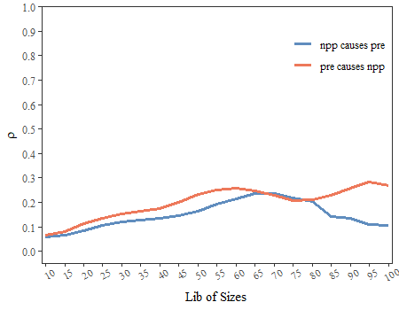

## 1.1 Install the `spEDM` package

Install the stable version from [CRAN](https://CRAN.R-project.org/package=spEDM) with:

```r
install.packages("spEDM", dep = TRUE)
```

Alternatively, you can install the development version from [R-universe](https://stscl.r-universe.dev/spEDM) with:

``` r
install.packages("spEDM",
                 repos = c("https://stscl.r-universe.dev",
                           "https://cloud.r-project.org"),
                 dep = TRUE)
```

## 1.2 An example of spatial lattice data

Load the `spEDM` package:


``` r
library(spEDM)
```

Load the county-level population density data from the `spEDM` package:


``` r
popd_nb = spdep::read.gal(system.file("extdata/popdensity_nb.gal",
                                      package = "spEDM"))
## Warning in spdep::read.gal(system.file("extdata/popdensity_nb.gal", package = "spEDM")): neighbour
## object has 4 sub-graphs
popd_nb
## Neighbour list object:
## Number of regions: 2806 
## Number of nonzero links: 15942 
## Percentage nonzero weights: 0.2024732 
## Average number of links: 5.681397 
## 4 disjoint connected subgraphs

popdensity = readr::read_csv(system.file("extdata/popdensity.csv",
                                         package = "spEDM"))
## Rows: 2806 Columns: 7
## ── Column specification ────────────────────────────────────────────────────────────────────────────────
## Delimiter: ","
## dbl (7): x, y, popDensity, DEM, Tem, Pre, slop
## 
## ℹ Use `spec()` to retrieve the full column specification for this data.
## ℹ Specify the column types or set `show_col_types = FALSE` to quiet this message.
popdensity
## # A tibble: 2,806 × 7
##        x     y popDensity   DEM   Tem   Pre  slop
##    <dbl> <dbl>      <dbl> <dbl> <dbl> <dbl> <dbl>
##  1  117.  30.5       780.     8  17.4 1528. 0.452
##  2  117.  30.6       395.    48  17.2 1487. 0.842
##  3  117.  30.8       261.    49  16.0 1456. 3.56 
##  4  116.  30.1       258.    23  17.4 1555. 0.932
##  5  116.  30.5       211.   101  16.3 1494. 3.34 
##  6  117.  31.0       386.    10  16.6 1382. 1.65 
##  7  117.  30.2       350.    23  17.5 1569. 0.346
##  8  117.  30.7       470.    22  17.1 1493. 1.88 
##  9  117.  30.6      1226.    11  17.4 1526. 0.208
## 10  116.  30.9       137.   598  13.9 1458. 5.92 
## # ℹ 2,796 more rows

popd_sf = sf::st_as_sf(popdensity, coords = c("x","y"), crs = 4326)
popd_sf
## Simple feature collection with 2806 features and 5 fields
## Geometry type: POINT
## Dimension:     XY
## Bounding box:  xmin: 74.9055 ymin: 18.2698 xmax: 134.269 ymax: 52.9346
## Geodetic CRS:  WGS 84
## # A tibble: 2,806 × 6
##    popDensity   DEM   Tem   Pre  slop          geometry
##  *      <dbl> <dbl> <dbl> <dbl> <dbl>       <POINT [°]>
##  1       780.     8  17.4 1528. 0.452 (116.912 30.4879)
##  2       395.    48  17.2 1487. 0.842 (116.755 30.5877)
##  3       261.    49  16.0 1456. 3.56  (116.541 30.7548)
##  4       258.    23  17.4 1555. 0.932  (116.241 30.104)
##  5       211.   101  16.3 1494. 3.34   (116.173 30.495)
##  6       386.    10  16.6 1382. 1.65  (116.935 30.9839)
##  7       350.    23  17.5 1569. 0.346 (116.677 30.2412)
##  8       470.    22  17.1 1493. 1.88  (117.066 30.6514)
##  9      1226.    11  17.4 1526. 0.208 (117.171 30.5558)
## 10       137.   598  13.9 1458. 5.92  (116.208 30.8983)
## # ℹ 2,796 more rows
```

Select the appropriate embedding dimension E:


``` r
simplex(popd_sf,"Pre",lib = 1:2000,pred = 2001:nrow(popd_sf),k = 6,nb = popd_nb)
## The suggested embedding dimension E for variable Pre is 1
##        E       rho      mae     rmse
##  [1,]  1 0.9944769 29.19078 44.20362
##  [2,]  2 0.9938551 29.75890 46.68020
##  [3,]  3 0.9923781 33.38572 52.24799
##  [4,]  4 0.9906213 36.93827 57.98292
##  [5,]  5 0.9879685 41.90347 66.04074
##  [6,]  6 0.9855116 46.67320 72.81851
##  [7,]  7 0.9831397 51.34790 79.25593
##  [8,]  8 0.9815603 55.13373 83.48991
##  [9,]  9 0.9801222 58.14001 87.12388
## [10,] 10 0.9779157 62.46149 92.64490
```


``` r
simplex(popd_sf,"popDensity",lib = 1:2000,pred = 2001:nrow(popd_sf),k = 6,nb = popd_nb)
## The suggested embedding dimension E for variable popDensity is 6
##        E       rho      mae     rmse
##  [1,]  1 0.8033220 717.2946 2390.767
##  [2,]  2 0.8964891 599.2670 1826.370
##  [3,]  3 0.8947098 578.9176 1820.573
##  [4,]  4 0.8945790 576.8006 1807.979
##  [5,]  5 0.8962965 570.3921 1807.007
##  [6,]  6 0.9054365 550.2581 1746.493
##  [7,]  7 0.8990063 575.2825 1797.437
##  [8,]  8 0.8976972 555.6466 1812.048
##  [9,]  9 0.8896512 558.8580 1861.250
## [10,] 10 0.8948435 561.8943 1825.444
```

We choose the E with the highest rho and the lowest MAE and RMSE as the most suitable one. Under the selected lib and pred, the optimal embedding dimension E for the variable `Pre` is 1, and for the variable `popDensity`, it is 6.

Then, run GCCM:


``` r
startTime = Sys.time()
pd_res = gccm(data = popd_sf,
              cause = "Pre",
              effect = "popDensity",
              libsizes = seq(10, 2800, by = 100),
              E = c(1,6),
              k = 6,
              nb = popd_nb,
              progressbar = FALSE)
endTime = Sys.time()
print(difftime(endTime,startTime, units ="mins"))
## Time difference of 22.65241 mins
pd_res
##    libsizes Pre->popDensity popDensity->Pre
## 1        10      0.04677107     0.008049854
## 2       110      0.16179426     0.017264648
## 3       210      0.22304657     0.022709492
## 4       310      0.25946987     0.027429925
## 5       410      0.29003978     0.032117526
## 6       510      0.32164387     0.035515863
## 7       610      0.35643363     0.037256067
## 8       710      0.38943229     0.039237100
## 9       810      0.41635987     0.040929980
## 10      910      0.44044756     0.042648992
## 11     1010      0.46321423     0.044811668
## 12     1110      0.48249031     0.047030589
## 13     1210      0.50181197     0.049470325
## 14     1310      0.51893175     0.051711027
## 15     1410      0.53501768     0.053550863
## 16     1510      0.55214906     0.054024306
## 17     1610      0.57152009     0.054208405
## 18     1710      0.59089731     0.054181634
## 19     1810      0.60925604     0.054514876
## 20     1910      0.62743438     0.054935632
## 21     2010      0.64520510     0.055536241
## 22     2110      0.66215325     0.056157075
## 23     2210      0.67865625     0.056502987
## 24     2310      0.69464383     0.056622385
## 25     2410      0.71027690     0.057080580
## 26     2510      0.72577544     0.057599522
## 27     2610      0.74108789     0.058239969
## 28     2710      0.75393770     0.059041395
```

Visualize the result:


``` r
plot(pd_res,xlimits = c(0, 2800))
```


## 1.3 An example of spatial grid data

Load the `spEDM` package:

```r
library(spEDM)
```

Load the farmland NPP data from the `spEDM` package:


``` r
npp = terra::rast(system.file("extdata/npp.tif", package = "spEDM"))
npp
## class       : SpatRaster 
## dimensions  : 404, 483, 3  (nrow, ncol, nlyr)
## resolution  : 10000, 10000  (x, y)
## extent      : -2625763, 2204237, 1877078, 5917078  (xmin, xmax, ymin, ymax)
## coord. ref. : CGCS2000_Albers 
## source      : npp.tif 
## names       :      npp,        pre,      tem 
## min values  :   164.00,   384.3409, -47.8194 
## max values  : 16606.33, 23878.3555, 263.6938

terra::plot(npp, nc = 3,
            mar = rep(0.1,4),
            oma = rep(0.1,4),
            axes = FALSE,
            legend = FALSE)
```


*To save the computation time, we will aggregate the data by 3 times and select 3000 non-NA pixels to predict:*


``` r
npp = terra::aggregate(npp, fact = 3, na.rm = TRUE)
terra::global(npp,"isNA")
##      isNA
## npp 14815
## pre 14766
## tem 14766
terra::ncell(npp)
## [1] 21735

nnamat = terra::as.matrix(!is.na(npp[[1]]), wide = TRUE)
nnaindice = terra::rowColFromCell(npp,which(nnamat))
dim(nnaindice)
## [1] 6920    2

set.seed(42)
indices = sample(nrow(nnaindice), size = 3000, replace = FALSE)
lib = nnaindice[-indices,]
pred = nnaindice[indices,]
```

Due to the high number of NA values in the npp raster data, we used all non-NA cell indices when testing for the most suitable embedding dimension.


``` r
simplex(npp,"pre",nnaindice,nnaindice,k = 5)
## The suggested embedding dimension E for variable pre is 2
##        E       rho      mae     rmse
##  [1,]  1 0.9986687 178.4244 249.0336
##  [2,]  2 0.9990454 143.8729 211.0650
##  [3,]  3 0.9989655 147.8098 219.8642
##  [4,]  4 0.9989633 149.6220 220.0648
##  [5,]  5 0.9988887 156.8683 228.0007
##  [6,]  6 0.9988100 163.2879 235.8832
##  [7,]  7 0.9987489 168.3787 241.7323
##  [8,]  8 0.9987067 170.0984 245.7405
##  [9,]  9 0.9987193 171.0634 244.5094
## [10,] 10 0.9987203 171.7493 244.4225
```


``` r
simplex(npp,"npp",nnaindice,nnaindice,k = 5)
## The suggested embedding dimension E for variable npp is 2
##        E       rho      mae     rmse
##  [1,]  1 0.9642440 424.0534 635.5334
##  [2,]  2 0.9730095 368.1354 551.5601
##  [3,]  3 0.9704364 363.8802 577.8385
##  [4,]  4 0.9700442 363.5774 581.6159
##  [5,]  5 0.9704260 356.6313 577.1581
##  [6,]  6 0.9705718 355.6638 575.4921
##  [7,]  7 0.9701489 357.7271 579.5552
##  [8,]  8 0.9705046 353.4836 575.9769
##  [9,]  9 0.9700359 351.7488 580.4887
## [10,] 10 0.9704014 348.8651 576.9918
```

Under the selected lib and pred, the optimal embedding dimension E for the variable `pre` is 2, and for the variable `npp`, it is also 2.

Then, run GCCM:


``` r
startTime = Sys.time()
npp_res = gccm(data = npp,
               cause = "pre",
               effect = "npp",
               libsizes = seq(10,130,5),
               E = 2,
               k = 5,
               pred = pred,
               progressbar = FALSE)
endTime = Sys.time()
print(difftime(endTime,startTime, units ="mins"))
## Time difference of 27.14689 mins
npp_res
##    libsizes   pre->npp   npp->pre
## 1        10 0.06372496 0.06203369
## 2        15 0.08834633 0.07153538
## 3        20 0.11227040 0.08592575
## 4        25 0.13802303 0.10135778
## 5        30 0.15715669 0.10412317
## 6        35 0.17383171 0.11082174
## 7        40 0.19458787 0.11619719
## 8        45 0.21683231 0.12748710
## 9        50 0.24306605 0.14341687
## 10       55 0.25837687 0.16762024
## 11       60 0.25799815 0.18573522
## 12       65 0.24920319 0.19850476
## 13       70 0.24053766 0.19747705
## 14       75 0.24687505 0.18426356
## 15       80 0.24670675 0.15772132
## 16       85 0.24365968 0.12437267
## 17       90 0.24655991 0.09931105
## 18       95 0.25216934 0.08129846
## 19      100 0.22270491 0.05082777
## 20      105 0.14153565 0.02867888
```

Visualize the result:


``` r
plot(npp_res,xlimits = c(9, 101),ylimits = c(-0.05,1))
## Warning: Removed 1 row containing missing values or values outside the scale range (`geom_line()`).
## Removed 1 row containing missing values or values outside the scale range (`geom_line()`).
```


