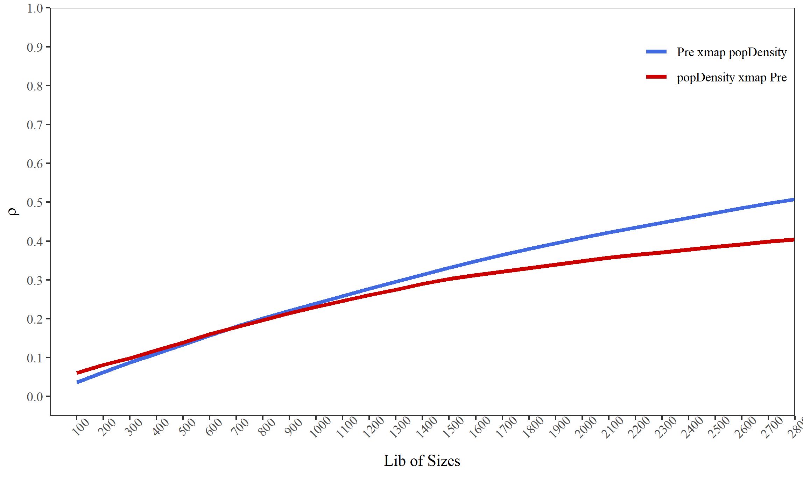

## 1. The principle of geographical convergent cross mapping (GCCM)

Takens’ theory proves that, for a dynamic system $\phi$, if its trajectory converges to an attractor manifold $M$, which are consisted by a bounded and invariant set of states, then the mapping between $\phi$ and M can be built and time series observations of $\phi$ can be used to construct $M$.

According to the generalized embedding theorem, for a compact $d$-dimensional manifold $M$ and a set of observation functions $\left<h_1,h_2,\ldots,h_L\right>$, the map $\psi_{\phi,h} = \left<h_1\left(x\right),h_2\left(x\right),\ldots,h_L\left(x\right)\right>$ is an embedding of $M$ with $L = 2d + 1$. Here embedding means a one-to-one map resolving all singularities of the original manifold. The elements $h_i$ can be lags of observations from single time series observations, lags of observations from multiple time series, or multiple observation functions. The first two constructions are only special cases of the third one.

By taking the measured values at one specific unit and its neighbors (named as spatial lags in spatial statistics) as a set of observation functions, $\psi_{\phi,h} \left(x,s\right) = \left<h_s\left(x\right),h_{s\left(1\right)}\left(x\right),\ldots,h_{s\left(L-1\right)}\left(x\right)\right>$ is a embedding, where $s$ is the focal unit currently under investigation and $s\left(i\right)$ is its $i$-th order of spatial lags. $h_s\left(x\right)$ and $h_{s\left(i\right)}\left(x\right)$ are their observation functions respectively. (Hereinafter, we will use $\psi \left(x,s\right)$ to present $\psi_{\phi,h} \left(x,s\right)$ for short). For two spatial variables $X$ and $Y$ on the same set of spatial units, their values and spatial lags can be regarded as observation functions reading values from each spatial unit. As the spatial lags in each order contain more than one spatial units, the observation function can be set as the mean of the spatial units or other summary functions considering the spatial direction, to assure the one-to-one mapping of the original manifold $M$.

The cross-mapping prediction is defined as:

$$
\hat{Y}_s \mid M_x = \sum\limits_{i=1}^{L+1} \left(\omega_{si}Y_{si} \mid M_x \right)
$$

where $s$ represents a spatial unit at which the value of $Y$ needs to be predicted, $\hat{Y}_s$ is the prediction result, $L$ is the number of dimensions of the embedding, $si$ is the spatial unit used in the prediction, $Y_{si}$ is the observation value at $si$ and simultaneously the first component of a state in $M_y$, noted as $\psi\left(y,s_i\right)$. In further, $\psi\left(y,s_i\right)$ is determined by its one-to-one mapping point $\psi\left(x,s_i\right)$, which is in turn one of the $L+1$ nearest neighbors of the focal state in $M_x$. $\omega_{si}$ is the corresponding weight defined as:

$$
\omega_{si} \mid M_x = \frac{weight \left(\psi\left(x,s_i\right),\psi\left(x,s\right)\right)}{\sum_{i=1}^{L+1}weight \left(\psi\left(x,s_i\right),\psi\left(x,s\right)\right)}
$$
where $weight \left(\ast,\ast\right)$ is the weight function between two states in the shadow manifold, defined as:

$$
weight \left(\psi\left(x,s_i\right),\psi\left(x,s\right)\right) =
\exp \left(- \frac{dis \left(\psi\left(x,s_i\right),\psi\left(x,s\right)\right)}{dis \left(\psi\left(x,s_1\right),\psi\left(x,s\right)\right)} \right)
$$

where $\exp$ is the exponential function and $dis \left(\ast,\ast\right)$ represents the distance function between two states in the shadow manifold defined as:

$$
dis \left(\psi\left(x,s_i\right),\psi\left(x,s\right)\right) = \frac{1}{L}
\left(\left|h_{si}\left(x\right)-h_{s}\left(x\right)\right| + \sum_{k=1}^{L-1}abs \left[h_{si\left(k\right)}\left(x\right),h_{s\left(k\right)}\left(x\right)\right]\right)
$$
Note that the absolute value distance is used here.

The skill of cross-mapping prediction is measured by the Pearson correlation coefficient between the true observations and corresponding predictions:

$$
\rho = \frac{Cov\left(Y,\hat{Y}\right)}{\sqrt{Var\left(Y\right) Var\left(\hat{Y}\right)}}
$$

The prediction skill $\rho$ varies by setting different sizes of libraries, which means the quantity of observations used in reconstruction of the shadow manifold. We can use the convergence of $\rho$ to infer the causal associations. For GCCM, the convergence means that $\rho$ increases with the size of libraries and is statistically significant when the library becomes largest. And the confidence interval of $\rho$ can be estimated based the $z$-statistics with the normal distribution:

$$
t = \rho \sqrt{\frac{n-2}{1-\rho^2}}
$$
where $n$ is the number of observations to be predicted, and

$$
z = \frac{1}{2} \ln \left(\frac{1+\rho}{1-\rho}\right)
$$

## 2. An example of county-level population density

```r
install.packages("spEDM", dep = TRUE)
```

Load data and package:


``` r
library(spEDM)

popdensity = readr::read_csv(system.file("extdata/popdensity.csv",
                                   package = "spEDM"))
## Rows: 2806 Columns: 7
## ── Column specification ───────────────────────────────────────────────────────────────────────
## Delimiter: ","
## dbl (7): x, y, popDensity, DEM, Tem, Pre, slop
## 
## ℹ Use `spec()` to retrieve the full column specification for this data.
## ℹ Specify the column types or set `show_col_types = FALSE` to quiet this message.
popdensity
## # A tibble: 2,806 × 7
##        x     y popDensity   DEM   Tem   Pre  slop
##    <dbl> <dbl>      <dbl> <dbl> <dbl> <dbl> <dbl>
##  1  117.  30.5       780.     8  17.4 1528. 0.452
##  2  117.  30.6       395.    48  17.2 1487. 0.842
##  3  117.  30.8       261.    49  16.0 1456. 3.56 
##  4  116.  30.1       258.    23  17.4 1555. 0.932
##  5  116.  30.5       211.   101  16.3 1494. 3.34 
##  6  117.  31.0       386.    10  16.6 1382. 1.65 
##  7  117.  30.2       350.    23  17.5 1569. 0.346
##  8  117.  30.7       470.    22  17.1 1493. 1.88 
##  9  117.  30.6      1226.    11  17.4 1526. 0.208
## 10  116.  30.9       137.   598  13.9 1458. 5.92 
## # ℹ 2,796 more rows
```

Construct the neighbours matrix and coordinates matrix.


``` r
popd_sf = sf::st_as_sf(popdensity,
                       coords = c("x","y"),
                       crs = 4326)
nb = sdsfun::spdep_nb(popd_sf, k = 8)
nbmat = spdep::nb2mat(nb, style = "B", zero.policy = TRUE)
diag(nbmat) = 0
nbmat[1:5,1:5]
##   [,1] [,2] [,3] [,4] [,5]
## 1    0    1    1    0    0
## 2    1    0    1    0    1
## 3    1    1    0    0    1
## 4    0    0    0    0    1
## 5    0    1    1    1    0
coords = sdsfun::sf_coordinates(popd_sf)
coords[1:5,]
##            X       Y
## [1,] 116.912 30.4879
## [2,] 116.755 30.5877
## [3,] 116.541 30.7548
## [4,] 116.241 30.1040
## [5,] 116.173 30.4950
```

Run GCCM:


``` r
res = gccm(cause = "popDensity",
           effect = "Pre",
           nbmat = nbmat,
           coords = coords,
           data = popd_sf,
           libsizes = seq(100, 2800, by = 100),
           E = 3)
res
## # A tibble: 28 × 9
##    lib_sizes x_xmap_y_mean x_xmap_y_sig x_xmap_y_upper x_xmap_y_lower y_xmap_x_mean
##        <dbl>         <dbl>        <dbl>          <dbl>          <dbl>         <dbl>
##  1       100        0.0364     5.37e- 2         0.0733      -0.000584        0.0603
##  2       200        0.0628     8.77e- 4         0.0996       0.0258          0.0817
##  3       300        0.0874     3.57e- 6         0.124        0.0505          0.0980
##  4       400        0.110      4.83e- 9         0.147        0.0735          0.119 
##  5       500        0.133      1.42e-12         0.169        0.0966          0.139 
##  6       600        0.157      0                0.193        0.121           0.160 
##  7       700        0.180      0                0.216        0.144           0.178 
##  8       800        0.201      0                0.236        0.165           0.196 
##  9       900        0.221      0                0.256        0.185           0.214 
## 10      1000        0.240      0                0.275        0.205           0.231 
## # ℹ 18 more rows
## # ℹ 3 more variables: y_xmap_x_sig <dbl>, y_xmap_x_upper <dbl>, y_xmap_x_lower <dbl>
```

Visualize the result:


``` r
windowsFonts(TNR = windowsFont("Times New Roman"))

fig_gccm = ggplot2::ggplot(data = res,
                           ggplot2::aes(x = lib_sizes)) +
  ggplot2::geom_line(ggplot2::aes(y = x_xmap_y_mean,
                                  color = "x xmap y"),
                      lwd = 1.25) +
  ggplot2::geom_line(ggplot2::aes(y = y_xmap_x_mean,
                                  color = "y xmap x"),
                     lwd = 1.25) +
  ggplot2::scale_y_continuous(breaks = seq(0, 1, by = 0.1),
                              limits = c(-0.05, 1), expand = c(0, 0),
                              name = expression(rho)) +
  ggplot2::scale_x_continuous(name = "Lib of Sizes",
                              breaks = seq(100, 2800, by = 100),
                              limits = c(0, 2800), expand = c(0, 0)) +
  ggplot2::scale_color_manual(values = c("x xmap y" = "royalblue",
                                         "y xmap x" = "red3"),
                              labels = c("Pre xmap popDensity",
                                         "popDensity xmap Pre"),
                              name = "") +
  ggplot2::theme_bw() +
  ggplot2::theme(axis.text = ggplot2::element_text(family = "TNR"),
                 axis.text.x = ggplot2::element_text(angle = 45),
                 axis.title = ggplot2::element_text(family = "TNR"),
                 panel.grid = ggplot2::element_blank(),
                 legend.position = "inside",
                 legend.justification = c('right','top'),
                 legend.background = ggplot2::element_rect(fill = 'transparent'),
                 legend.text = ggplot2::element_text(family = "TNR"))
fig_gccm
```



