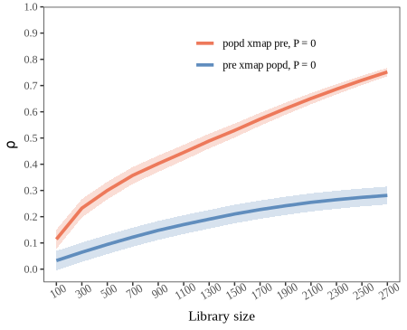

## Model principles

Let $Y = \{y_i\}$ and $X = \{x_i\}$ be the two spatial cross sectional variable, where $i = 1, 2, \dots, n$ denotes spatial units (e.g., regions or grid cells), the shadow manifolds of $X$ can be constructed using the different spatial lag values of all spatial units:

$$
M_{x} = \begin{bmatrix}
S_{(1)}(x_1) & S_{(1 + \tau)}(x_1) & \cdots & S_{(1+(E-1)\tau)}(x_1) \\
S_{(1)}(x_2) & S_{(1 + \tau)}(x_2) & \cdots & S_{(1+(E-1)\tau)}(x_2) \\
\vdots & \vdots & \ddots & \vdots \\
S_{(1)}(x_n) & S_{(1 + \tau)}(x_n) & \cdots & S_{(1+(E-1)\tau)}(x_n)
\end{bmatrix}
$$

Here, $S_{(j)}(x_i)$ denotes the $j$ th-order spatial lag value of spatial unit $i$, $\tau $ is the step size for the spatial lag order, and $E$ is the embedding dimension and $M_{x}$ corresponds to the shadow manifolds of $X$.

With the reconstructed shadow manifolds $M_{x}$, the state of Y can be predicted with the state of X through

$$
\hat{Y}_s \mid M_x = \sum\limits_{i=1}^k \left(\omega_{si}Y_{si} \mid M_x \right)
$$

where $s$ represents a spatial unit at which the value of $Y$ needs to be predicted, $\hat{Y}_s$ is the prediction result, $k$ is the number of nearest neighbors used for prediction, $si$ is the spatial unit used in the prediction, $Y_{si}$ is the observation value of $Y$ at $si$. $\omega_{si}$ is the corresponding weight defined as:

$$
\omega_{si} \mid M_x = \frac{weight \left(\psi\left(M_x,s_i\right),\psi\left(M_x,s\right)\right)}{\sum_{i=1}^{L+1}weight \left(\psi\left(M_x,s_i\right),\psi\left(M_x,s\right)\right)}
$$

where $\psi(M_x, s_i)$ is the state vector of spatial unit $s_i$ in the shadow manifold $ M_x$, and $weight (\ast, \ast)$ is the weight function between two states in the shadow manifold, defined as:

$$
weight \left(\psi\left(M_x,s_i\right),\psi\left(M_x,s\right)\right) =
\exp \left(- \frac{dis \left(\psi\left(M_x,s_i\right),\psi\left(M_x,s\right)\right)}{dis \left(\psi\left(M_x,s_1\right),\psi\left(M_x,s\right)\right)} \right)
$$

where $\exp$ is the exponential function and $dis \left(\ast,\ast\right)$ represents the distance function between two states in the shadow manifold defined as:


$$
dis \left( \psi(M_x, s_i), \psi(M_x, s) \right) = \frac{1}{E} \sum_{m=1}^{E} \left| \psi_m(M_x, s_i) - \psi_m(M_x, s) \right|
$$

where $dis \left( \psi(M_x, s_i), \psi(M_x, s) \right)$ denotes the average absolute difference between corresponding elements of the two state vectors in the shadow manifold $M_x$, $E$ is the embedding dimension, and $\psi_m(M_x, s_i)$ is the $m$-th element of the state vector $\psi(M_x, s_i)$.

The skill of cross-mapping prediction $\rho$ is measured by the Pearson correlation coefficient between the true observations and corresponding predictions, and the confidence interval of $\rho$ can be estimated based the $z$-statistics with the normal distribution:

$$
\rho = \frac{Cov\left(Y,\hat{Y}\mid M_x\right)}{\sqrt{Var\left(Y\right) Var\left(\hat{Y}\mid M_x\right)}}
$$

$$
t = \rho \sqrt{\frac{n-2}{1-\rho^2}}
$$

where $n$ is the number of observations to be predicted, and

$$
z = \frac{1}{2} \ln \left(\frac{1+\rho}{1-\rho}\right)
$$

The prediction skill $\rho$ varies by setting different sizes of libraries, which means the quantity of observations used in reconstruction of the shadow manifold. We can use the convergence of $\rho$ to infer the causal associations. For GCCM, the convergence means that $\rho$ increases with the size of libraries and is statistically significant when the library becomes largest.

$$
\rho_{x \to y} = \lim_{L \to \infty} cor \left( Y,\hat{Y}\mid M_x \right)
$$

where $\rho_{x \to y}$ is the correlation after convergence, used to measure the causation effect from $Y$ to $X$, despite the notation suggesting the reverse direction.

## Usage examples

### An example of spatial lattice data

Load the `spEDM` package and its county-level population density data:


``` r
library(spEDM)

popd_nb = spdep::read.gal(system.file("case/popd_nb.gal",package = "spEDM"))
## Warning in spdep::read.gal(system.file("case/popd_nb.gal", package = "spEDM")):
## neighbour object has 4 sub-graphs
popd = readr::read_csv(system.file("case/popd.csv",package = "spEDM"))
## Rows: 2806 Columns: 7
## ── Column specification ────────────────────────────────────────────────────────────────────────────
## Delimiter: ","
## dbl (7): x, y, popd, elev, tem, pre, slope
## 
## ℹ Use `spec()` to retrieve the full column specification for this data.
## ℹ Specify the column types or set `show_col_types = FALSE` to quiet this message.
popd_sf = sf::st_as_sf(popd, coords = c("x","y"), crs = 4326)
popd_sf
## Simple feature collection with 2806 features and 5 fields
## Geometry type: POINT
## Dimension:     XY
## Bounding box:  xmin: 74.9055 ymin: 18.2698 xmax: 134.269 ymax: 52.9346
## Geodetic CRS:  WGS 84
## # A tibble: 2,806 × 6
##     popd  elev   tem   pre slope          geometry
##  * <dbl> <dbl> <dbl> <dbl> <dbl>       <POINT [°]>
##  1  780.     8  17.4 1528. 0.452 (116.912 30.4879)
##  2  395.    48  17.2 1487. 0.842 (116.755 30.5877)
##  3  261.    49  16.0 1456. 3.56  (116.541 30.7548)
##  4  258.    23  17.4 1555. 0.932  (116.241 30.104)
##  5  211.   101  16.3 1494. 3.34   (116.173 30.495)
##  6  386.    10  16.6 1382. 1.65  (116.935 30.9839)
##  7  350.    23  17.5 1569. 0.346 (116.677 30.2412)
##  8  470.    22  17.1 1493. 1.88  (117.066 30.6514)
##  9 1226.    11  17.4 1526. 0.208 (117.171 30.5558)
## 10  137.   598  13.9 1458. 5.92  (116.208 30.8983)
## # ℹ 2,796 more rows
```

Select the appropriate embedding dimension E:


``` r
simplex(popd_sf,"pre",lib = 1:2000,pred = 2001:nrow(popd_sf),k = 6,nb = popd_nb,trend.rm = TRUE)
## The suggested E and k for variable pre is 2 and 6
```


``` r
simplex(popd_sf,"popd",lib = 1:2000,pred = 2001:nrow(popd_sf),k = 6,nb = popd_nb,trend.rm = TRUE)
## The suggested E and k for variable popd is 5 and 6
```

We choose the E with the highest rho and the lowest MAE and RMSE as the most suitable one. Under the selected lib and pred, the optimal embedding dimension E for the variable `pre` is 2, and for the variable `popdensity`, it is 5.

Then, run GCCM:


``` r
startTime = Sys.time()
pd_res = gccm(data = popd_sf,
              cause = "pre",
              effect = "popd",
              libsizes = seq(10, 2800, by = 100),
              E = c(2,5),
              k = 6,
              nb = popd_nb,
              progressbar = FALSE)
endTime = Sys.time()
print(difftime(endTime,startTime, units ="mins"))
## Time difference of 5.85621 mins
pd_res
##    libsizes  pre->popd  popd->pre
## 1        10 0.05589905 0.01004636
## 2       110 0.18109636 0.03478543
## 3       210 0.24325566 0.04932428
## 4       310 0.27657692 0.06417637
## 5       410 0.30630281 0.07634983
## 6       510 0.34116169 0.08815848
## 7       610 0.38078810 0.09890353
## 8       710 0.41612716 0.10867846
## 9       810 0.44420437 0.11714337
## 10      910 0.46815429 0.12485229
## 11     1010 0.48876449 0.13194552
## 12     1110 0.50538462 0.13802611
## 13     1210 0.52300459 0.14335037
## 14     1310 0.53902632 0.14813342
## 15     1410 0.55309048 0.15284706
## 16     1510 0.56754023 0.15777314
## 17     1610 0.58387624 0.16301596
## 18     1710 0.60029184 0.16768202
## 19     1810 0.61631190 0.17202960
## 20     1910 0.63213899 0.17601166
## 21     2010 0.64785899 0.17979878
## 22     2110 0.66289302 0.18304365
## 23     2210 0.67740971 0.18596497
## 24     2310 0.69156193 0.18906187
## 25     2410 0.70541793 0.19196548
## 26     2510 0.71925253 0.19503355
## 27     2610 0.73287448 0.19819076
## 28     2710 0.74435871 0.20116518
```

Visualize the result:


``` r
plot(pd_res,xlimits = c(0, 2800)) +
  ggplot2::theme(legend.justification = c(0.85,1))
```



### An example of spatial grid data

Load the `spEDM` package and its farmland NPP data:


``` r
library(spEDM)

npp = terra::rast(system.file("case/npp.tif", package = "spEDM"))
npp
## class       : SpatRaster 
## dimensions  : 404, 483, 4  (nrow, ncol, nlyr)
## resolution  : 10000, 10000  (x, y)
## extent      : -2625763, 2204237, 1877078, 5917078  (xmin, xmax, ymin, ymax)
## coord. ref. : CGCS2000_Albers 
## source      : npp.tif 
## names       :      npp,        pre,      tem,      elev 
## min values  :   164.00,   384.3409, -47.8194, -122.2004 
## max values  : 16606.33, 23878.3555, 263.6938, 5350.4902

# To save the computation time, we will aggregate the data by 3 times
npp = terra::aggregate(npp, fact = 3, na.rm = TRUE)
npp
## class       : SpatRaster 
## dimensions  : 135, 161, 4  (nrow, ncol, nlyr)
## resolution  : 30000, 30000  (x, y)
## extent      : -2625763, 2204237, 1867078, 5917078  (xmin, xmax, ymin, ymax)
## coord. ref. : CGCS2000_Albers 
## source(s)   : memory
## names       :      npp,        pre,      tem,      elev 
## min values  :   187.50,   390.3351, -47.8194, -110.1494 
## max values  : 15381.89, 23734.5330, 262.8576, 5217.6431

# Inspect NA values
terra::global(npp,"isNA")
##       isNA
## npp  14815
## pre  14766
## tem  14766
## elev 14760
terra::ncell(npp)
## [1] 21735
nnamat = terra::as.matrix(npp[[1]], wide = TRUE)
nnaindice = which(!is.na(nnamat), arr.ind = TRUE)
dim(nnaindice)
## [1] 6920    2

# Select 1500 non-NA pixels to predict:
set.seed(2025)
indices = sample(nrow(nnaindice), size = 1500, replace = FALSE)
libindice = nnaindice[-indices,]
predindice = nnaindice[indices,]
```

Due to the high number of NA values in the npp raster data, we used all non-NA cell as the libraries when testing for the most suitable embedding dimensions.


``` r
simplex(npp,"pre",nnaindice,predindice,k = 8,trend.rm = TRUE)
## The suggested E and k for variable pre is 2 and 8
```


``` r
simplex(npp,"npp",nnaindice,predindice,k = 8,trend.rm = TRUE)
## The suggested E and k for variable npp is 10 and 8
```

Under the selected lib and pred, the optimal embedding dimension E for the variable `pre` is 2, and for the variable `npp`, it is 10.

Then, run GCCM:


``` r
startTime = Sys.time()
npp_res = gccm(data = npp,
               cause = "pre",
               effect = "npp",
               libsizes = as.matrix(expand.grid(seq(10,130,10),seq(10,160,10))),
               E = c(2,10),
               k = 8,
               lib = nnaindice,
               pred = predindice,
               progressbar = FALSE)
endTime = Sys.time()
print(difftime(endTime,startTime, units ="mins"))
## Time difference of 9.490029 mins
npp_res
##    libsizes  pre->npp  npp->pre
## 1        10 0.1295281 0.1013898
## 2        20 0.1990710 0.1605447
## 3        30 0.2607783 0.2286559
## 4        40 0.3219650 0.2744616
## 5        50 0.3788341 0.2956426
## 6        60 0.4512668 0.3272331
## 7        70 0.4961658 0.3394660
## 8        80 0.5366037 0.3378108
## 9        90 0.5972341 0.3376894
## 10      100 0.6670024 0.3405838
## 11      110 0.7358447 0.3412305
## 12      120 0.7981711 0.3500295
## 13      130 0.8386849 0.3663077
## 14      140 0.8460446 0.3687385
## 15      150 0.8483344 0.3696080
## 16      160 0.8503816 0.3695784
```

Visualize the result:


``` r
plot(npp_res,xlimits = c(9, 161),ylimits = c(0.05,1)) +
  ggplot2::theme(legend.justification = c(0.25,1))
```


