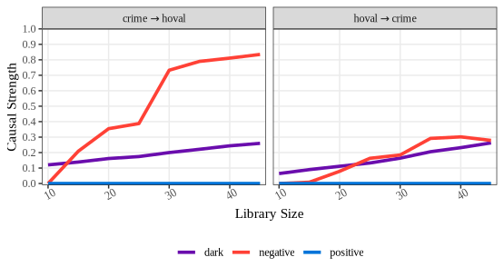
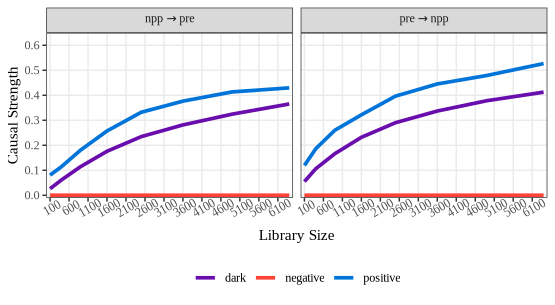

## Methodological Background

Geographical Pattern Causality (GPC) infers causal relations from spatial cross-sectional data by reconstructing a symbolic approximation of the underlying spatial dynamical system.

Let $x(s)$ and $y(s)$ denote two spatial cross-sections over locations $s \in \mathcal{S}$.

**(1) Spatial Embedding**

For each location $s_i$, GPC constructs an embedding vector

$$
\mathbf{E}_{x(s_i)} = \big( x(s_{i}^{(1)}), x(s_{i}^{(2)}), \dots, x(s_{i}^{(E\tau)}) \big),
$$

where $s_{i}^{(k)}$ denotes the $k$-th spatially lagged value of the spatial unit $s_i$, determined by embedding dimension $E$ and lag $\tau$.
This yields two reconstructed state spaces $\mathcal{M}_x, \mathcal{M}_y \subset \mathbb{R}^E$.

**(2) Symbolic Pattern Extraction**

Local geometric transitions in each manifold are mapped to symbols

$$
\sigma_x(s_i),; \sigma_y(s_i) \in \mathcal{A},
$$

encoding increasing, decreasing, or non-changing modes. These symbolic trajectories summarize local pattern evolution.

**(3) Cross-Pattern Mapping**

Causality from $x \to y$ is assessed by predicting:

$$
\hat{\sigma}_y(s_i) = F\big( \sigma_x(s_j): s_j \in \mathcal{N}_k(s_i) \big),
$$

where $\mathcal{N}_k$ denotes the set of $k$ nearest neighbors in $\mathcal{M}_x$.
The agreement structure between $\hat{\sigma}_y(s_i)$ and $\sigma_y(s_i)$ determines the causal mode:

* Positive: $\hat{\sigma}_y = \sigma_y$
* Negative: $\hat{\sigma}_y = -\sigma_y$
* Dark: neither agreement nor opposition

**(4) Causal Strength**

The global causal strength is the normalized consistency of symbol matches:

$$
C_{x \to y} = \frac{1}{|\mathcal{S}|} \sum_{s_i \in \mathcal{S}} \mathbb{I}\big[ \hat{\sigma}_y(s_i) \bowtie \sigma_y(s_i) \big],
$$

where $\bowtie$ encodes positive, negative, or dark matching rules.

## Usage examples

### An example of spatial lattice data

Load the `spEDM` package and its columbus spatial analysis data:


``` r
library(spEDM)

columbus = sf::read_sf(system.file("case/columbus.gpkg", package="spEDM"))
columbus
## Simple feature collection with 49 features and 6 fields
## Geometry type: POLYGON
## Dimension:     XY
## Bounding box:  xmin: 5.874907 ymin: 10.78863 xmax: 11.28742 ymax: 14.74245
## Projected CRS: Undefined Cartesian SRS with unknown unit
## # A tibble: 49 × 7
##    hoval   inc  crime  open plumb discbd                                    geom
##    <dbl> <dbl>  <dbl> <dbl> <dbl>  <dbl>                               <POLYGON>
##  1  80.5 19.5  15.7   2.85  0.217   5.03 ((8.624129 14.23698, 8.5597 14.74245, …
##  2  44.6 21.2  18.8   5.30  0.321   4.27 ((8.25279 14.23694, 8.282758 14.22994,…
##  3  26.4 16.0  30.6   4.53  0.374   3.89 ((8.653305 14.00809, 8.81814 14.00205,…
##  4  33.2  4.48 32.4   0.394 1.19    3.7  ((8.459499 13.82035, 8.473408 13.83227…
##  5  23.2 11.3  50.7   0.406 0.625   2.83 ((8.685274 13.63952, 8.677577 13.72221…
##  6  28.8 16.0  26.1   0.563 0.254   3.78 ((9.401384 13.5504, 9.434411 13.69427,…
##  7  75    8.44  0.178 0     2.40    2.74 ((8.037741 13.60752, 8.062716 13.60452…
##  8  37.1 11.3  38.4   3.48  2.74    2.89 ((8.247527 13.58651, 8.2795 13.5965, 8…
##  9  52.6 17.6  30.5   0.527 0.891   3.17 ((9.333297 13.27242, 9.671007 13.27361…
## 10  96.4 13.6  34.0   1.55  0.558   4.33 ((10.08251 13.03377, 10.0925 13.05275,…
## # ℹ 39 more rows
```

The false nearest neighbours (FNN) method helps identify the appropriate minimal embedding dimension for reconstructing the state space of a time series or spatial cross-sectional data.


``` r
spEDM::fnn(columbus, "crime", E = 1:10, eps = stats::sd(columbus$crime))
##        E:1        E:2        E:3        E:4        E:5        E:6        E:7 
## 0.59183673 0.04081633 0.04081633 0.10204082 0.00000000 0.00000000 0.00000000 
##        E:8 
## 0.00000000
```

The false nearest neighbours (FNN) ratio decreased to approximately 0.001 when the embedding dimension E reached 7, and remained relatively stable thereafter. Therefore, we adopted $E = 7$ as the minimal embedding dimension for subsequent parameter search.

Then, search optimal parameters:


``` r
# determine the type of causality using correlation
stats::cor.test(columbus$hoval,columbus$crime)
## 
## 	Pearson's product-moment correlation
## 
## data:  columbus$hoval and columbus$crime
## t = -4.8117, df = 47, p-value = 1.585e-05
## alternative hypothesis: true correlation is not equal to 0
## 95 percent confidence interval:
##  -0.7366777 -0.3497978
## sample estimates:
##        cor 
## -0.5744867

# since the correlation is -0.574, negative causality is selected as the metric to maximize in the optimal parameter search
spEDM::pc(columbus, "hoval", "crime", E = 5:10, k = 6:12, maximize = "negative")
## The suggested E,k,tau for variable crime is 5, 6 and 1
```

Run geographical pattern causality analysis


``` r
spEDM::gpc(columbus, "hoval", "crime", E = 5, k = 6)
## -------------------------------- 
## ***pattern causality analysis*** 
## -------------------------------- 
##       type  strength      direction
## 1 positive       NaN hoval -> crime
## 2 negative       NaN hoval -> crime
## 3     dark 0.3298410 hoval -> crime
## 4 positive       NaN crime -> hoval
## 5 negative 0.8141928 crime -> hoval
## 6     dark 0.2612294 crime -> hoval
```

Convergence diagnostics


``` r
crime_convergence = spEDM::gpc(columbus, "hoval", "crime",
                               libsizes = seq(5, 45, by = 5),
                               E = 5, k = 6, progressbar = FALSE)
crime_convergence
## -------------------------------- 
## ***pattern causality analysis*** 
## -------------------------------- 
##    libsizes     type       mean        q05         q50       q95      direction
## 1        10 positive 0.00000000 0.00000000 0.000000000 0.0000000 hoval -> crime
## 2        15 positive 0.00000000 0.00000000 0.000000000 0.0000000 hoval -> crime
## 3        20 positive 0.00000000 0.00000000 0.000000000 0.0000000 hoval -> crime
## 4        25 positive 0.00000000 0.00000000 0.000000000 0.0000000 hoval -> crime
## 5        30 positive 0.00000000 0.00000000 0.000000000 0.0000000 hoval -> crime
## 6        35 positive 0.00000000 0.00000000 0.000000000 0.0000000 hoval -> crime
## 7        40 positive 0.00000000 0.00000000 0.000000000 0.0000000 hoval -> crime
## 8        45 positive 0.00000000 0.00000000 0.000000000 0.0000000 hoval -> crime
## 9        10 negative 0.05950460 0.00000000 0.000000000 0.2247628 hoval -> crime
## 10       15 negative 0.10174077 0.00000000 0.005706428 0.3592752 hoval -> crime
## 11       20 negative 0.14628071 0.00000000 0.000000000 0.4984601 hoval -> crime
## 12       25 negative 0.17990683 0.00000000 0.081407356 0.7000259 hoval -> crime
## 13       30 negative 0.17794877 0.00000000 0.131143404 0.5575390 hoval -> crime
## 14       35 negative 0.22786205 0.00000000 0.167994547 0.6812520 hoval -> crime
## 15       40 negative 0.21932763 0.00000000 0.136677698 0.6961524 hoval -> crime
## 16       45 negative 0.22352119 0.00000000 0.077536696 0.6712917 hoval -> crime
## 17       10     dark 0.06531566 0.01515338 0.060217479 0.1197882 hoval -> crime
## 18       15     dark 0.07979254 0.03228090 0.077067818 0.1401099 hoval -> crime
## 19       20     dark 0.09754467 0.04470991 0.095590746 0.1568536 hoval -> crime
## 20       25     dark 0.12473834 0.07162279 0.123388926 0.1761206 hoval -> crime
## 21       30     dark 0.16558924 0.10580394 0.166073847 0.2359441 hoval -> crime
## 22       35     dark 0.19189537 0.12780963 0.185636641 0.2568677 hoval -> crime
## 23       40     dark 0.25393701 0.19430501 0.250831677 0.3276002 hoval -> crime
## 24       45     dark 0.29681320 0.22454950 0.305167821 0.3493305 hoval -> crime
## 25       10 positive 0.00000000 0.00000000 0.000000000 0.0000000 crime -> hoval
## 26       15 positive 0.00000000 0.00000000 0.000000000 0.0000000 crime -> hoval
## 27       20 positive 0.00000000 0.00000000 0.000000000 0.0000000 crime -> hoval
## 28       25 positive 0.00000000 0.00000000 0.000000000 0.0000000 crime -> hoval
## 29       30 positive 0.00000000 0.00000000 0.000000000 0.0000000 crime -> hoval
## 30       35 positive 0.00000000 0.00000000 0.000000000 0.0000000 crime -> hoval
## 31       40 positive 0.00000000 0.00000000 0.000000000 0.0000000 crime -> hoval
## 32       45 positive 0.00000000 0.00000000 0.000000000 0.0000000 crime -> hoval
## 33       10 negative 0.13376335 0.00000000 0.000000000 0.7159593 crime -> hoval
## 34       15 negative 0.26471178 0.00000000 0.251548591 0.7200330 crime -> hoval
## 35       20 negative 0.39007000 0.00000000 0.368437040 0.7652072 crime -> hoval
## 36       25 negative 0.45379519 0.00000000 0.378381350 0.7804124 crime -> hoval
## 37       30 negative 0.56717965 0.33190864 0.545581258 0.8141928 crime -> hoval
## 38       35 negative 0.66913116 0.35502961 0.763773524 0.8160186 crime -> hoval
## 39       40 negative 0.72025362 0.38719017 0.796561839 0.8160186 crime -> hoval
## 40       45 negative 0.79308343 0.75878312 0.814192827 0.8199945 crime -> hoval
## 41       10     dark 0.12141574 0.04609960 0.117640374 0.1982255 crime -> hoval
## 42       15     dark 0.14315815 0.07686438 0.144046153 0.2122906 crime -> hoval
## 43       20     dark 0.16265271 0.10176618 0.156875827 0.2275340 crime -> hoval
## 44       25     dark 0.17369862 0.10857485 0.171868915 0.2329307 crime -> hoval
## 45       30     dark 0.18952308 0.12566502 0.186813513 0.2543896 crime -> hoval
## 46       35     dark 0.20907878 0.14166490 0.212348766 0.2749545 crime -> hoval
## 47       40     dark 0.23258768 0.17127369 0.234056529 0.2927512 crime -> hoval
## 48       45     dark 0.24768206 0.19735241 0.248479635 0.2982938 crime -> hoval
plot(crime_convergence, ylimits = c(-0.01,1),
     xlimits = c(9,46), xbreaks = seq(10, 45, 10))
```



### An example of spatial grid data

Load the `spEDM` package and its farmland NPP data:


``` r
library(spEDM)

npp = terra::rast(system.file("case/npp.tif", package = "spEDM"))
# To save the computation time, we will aggregate the data by 3 times
npp = terra::aggregate(npp, fact = 3, na.rm = TRUE)
npp
## class       : SpatRaster 
## size        : 135, 161, 5  (nrow, ncol, nlyr)
## resolution  : 30000, 30000  (x, y)
## extent      : -2625763, 2204237, 1867078, 5917078  (xmin, xmax, ymin, ymax)
## coord. ref. : CGCS2000_Albers 
## source(s)   : memory
## names       :      npp,        pre,      tem,      elev,         hfp 
## min values  :   187.50,   390.3351, -47.8194, -110.1494,  0.04434316 
## max values  : 15381.89, 23734.5330, 262.8576, 5217.6431, 42.68803711

# Check the validated cell number
nnamat = terra::as.matrix(npp[[1]], wide = TRUE)
nnaindice = which(!is.na(nnamat), arr.ind = TRUE)
dim(nnaindice)
## [1] 6920    2
```

Determining minimal embedding dimension:


``` r
fnn(npp, "npp", E = 1:15,
    eps = stats::sd(terra::values(npp[["npp"]]),na.rm = TRUE))
##          E:1          E:2          E:3          E:4          E:5          E:6 
## 0.9813070569 0.5309427415 0.1322254335 0.0167630058 0.0017341040 0.0000000000 
##          E:7          E:8          E:9         E:10         E:11         E:12 
## 0.0001445087 0.0000000000 0.0000000000 0.0000000000 0.0002890173 0.0000000000 
##         E:13         E:14 
## 0.0001445087 0.0001445087
```

At $E = 6$, the false nearest neighbor ratio stabilizes approximately at 0.0001 and remains constant thereafter. Therefore, $E = 6$ is selected as minimal embedding dimension for the subsequent GPC analysis.

Then, search optimal parameters:


``` r
stats::cor.test(~ pre + npp,
                data = terra::values(npp[[c("pre","npp")]],
                                      datafame = TRUE, na.rm = TRUE))
## 
## 	Pearson's product-moment correlation
## 
## data:  pre and npp
## t = 108.74, df = 6912, p-value < 2.2e-16
## alternative hypothesis: true correlation is not equal to 0
## 95 percent confidence interval:
##  0.7855441 0.8029426
## sample estimates:
##       cor 
## 0.7944062


g1 = spEDM::pc(npp, "npp", "pre", E = 6:10, k = 7:12, maximize = "positive")
g1
## The suggested E,k,tau for variable pre is 10, 8 and 1
```

Run geographical pattern causality analysis


``` r
spEDM::gpc(npp, "pre", "npp", E = 10, k = 8)
## -------------------------------- 
## ***pattern causality analysis*** 
## -------------------------------- 
##       type   strength  direction
## 1 positive 0.17965602 pre -> npp
## 2 negative 0.07729251 pre -> npp
## 3     dark 0.11239454 pre -> npp
## 4 positive 0.11660150 npp -> pre
## 5 negative 0.02076095 npp -> pre
## 6     dark 0.07491261 npp -> pre
```

Convergence diagnostics


``` r
npp_convergence = spEDM::gpc(npp, "pre", "npp",
                             libsizes = matrix(rep(seq(10,80,10),2),ncol = 2),
                             E = 10, k = 8, progressbar = FALSE)
npp_convergence
## -------------------------------- 
## ***pattern causality analysis*** 
## -------------------------------- 
##    libsizes     type        mean         q05         q50         q95  direction
## 1       100 positive 0.031115313 0.007586101 0.029699586 0.058335871 pre -> npp
## 2       400 positive 0.046321136 0.025965817 0.043444827 0.072677663 pre -> npp
## 3       900 positive 0.061289327 0.036546196 0.060742103 0.088607440 pre -> npp
## 4      1600 positive 0.076140862 0.052179914 0.073213997 0.109569849 pre -> npp
## 5      2500 positive 0.099999344 0.061554432 0.099303348 0.138071568 pre -> npp
## 6      3600 positive 0.126697417 0.098448170 0.123791233 0.167912560 pre -> npp
## 7      4900 positive 0.146035271 0.112762146 0.145172371 0.183307027 pre -> npp
## 8      6400 positive 0.160439882 0.134164256 0.160445471 0.186289425 pre -> npp
## 9       100 negative 0.005034612 0.000000000 0.000000000 0.040091076 pre -> npp
## 10      400 negative 0.009928927 0.000000000 0.000000000 0.052005414 pre -> npp
## 11      900 negative 0.019165255 0.000000000 0.009337993 0.059256988 pre -> npp
## 12     1600 negative 0.029471659 0.000000000 0.027997599 0.073358489 pre -> npp
## 13     2500 negative 0.045285442 0.000000000 0.038739984 0.117191230 pre -> npp
## 14     3600 negative 0.065880615 0.018235836 0.061356270 0.141681812 pre -> npp
## 15     4900 negative 0.084468586 0.022971353 0.085285422 0.147335973 pre -> npp
## 16     6400 negative 0.084044451 0.049760990 0.083386491 0.119344985 pre -> npp
## 17      100     dark 0.011013023 0.007197887 0.011167831 0.015515615 pre -> npp
## 18      400     dark 0.020940904 0.017941858 0.021144785 0.024073808 pre -> npp
## 19      900     dark 0.031601592 0.028162694 0.031760585 0.035366888 pre -> npp
## 20     1600     dark 0.043908454 0.040426567 0.043749224 0.047899451 pre -> npp
## 21     2500     dark 0.057340747 0.053427426 0.057373516 0.060924723 pre -> npp
## 22     3600     dark 0.071494236 0.068717216 0.071382799 0.074614915 pre -> npp
## 23     4900     dark 0.087452806 0.084720124 0.087498875 0.090183299 pre -> npp
## 24     6400     dark 0.105697810 0.103544775 0.105670612 0.108333330 pre -> npp
## 25      100 positive 0.028569076 0.007135101 0.019419478 0.071601455 npp -> pre
## 26      400 positive 0.028527969 0.010031453 0.023908329 0.058591795 npp -> pre
## 27      900 positive 0.036122075 0.014168932 0.033033341 0.072532610 npp -> pre
## 28     1600 positive 0.047301056 0.022247962 0.045376114 0.075475672 npp -> pre
## 29     2500 positive 0.062906169 0.028936818 0.060119839 0.104134649 npp -> pre
## 30     3600 positive 0.074948324 0.045138188 0.072470117 0.112803779 npp -> pre
## 31     4900 positive 0.083409494 0.048460474 0.083202422 0.117838640 npp -> pre
## 32     6400 positive 0.106386835 0.083585629 0.105913467 0.134241910 npp -> pre
## 33      100 negative 0.001566391 0.000000000 0.000000000 0.000000000 npp -> pre
## 34      400 negative 0.005371967 0.000000000 0.000000000 0.046138545 npp -> pre
## 35      900 negative 0.010685798 0.000000000 0.000000000 0.064695365 npp -> pre
## 36     1600 negative 0.017622470 0.000000000 0.000000000 0.080482876 npp -> pre
## 37     2500 negative 0.020698786 0.000000000 0.000000000 0.098537549 npp -> pre
## 38     3600 negative 0.035225131 0.000000000 0.021011460 0.114145672 npp -> pre
## 39     4900 negative 0.034850456 0.000000000 0.021083127 0.108604078 npp -> pre
## 40     6400 negative 0.025038433 0.000000000 0.020679089 0.113766520 npp -> pre
## 41      100     dark 0.004604517 0.002854011 0.004442657 0.006721233 npp -> pre
## 42      400     dark 0.008262464 0.006587996 0.008188746 0.010439919 npp -> pre
## 43      900     dark 0.013515105 0.011390468 0.013516033 0.015781187 npp -> pre
## 44     1600     dark 0.020433735 0.017767217 0.020359584 0.023339187 npp -> pre
## 45     2500     dark 0.029553489 0.026785664 0.029602973 0.032346106 npp -> pre
## 46     3600     dark 0.041560369 0.038825309 0.041816757 0.043929426 npp -> pre
## 47     4900     dark 0.054361839 0.050772943 0.054568296 0.058879846 npp -> pre
## 48     6400     dark 0.069653176 0.066307341 0.069487729 0.072397154 npp -> pre
plot(npp_convergence, ylimits = c(-0.01,0.35),
     xlimits = c(0,6500), xbreaks = seq(100, 6400, 500))
```


